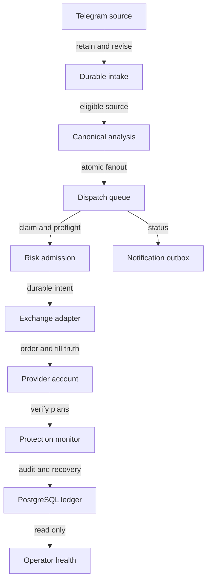
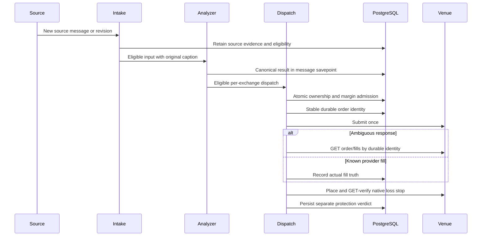
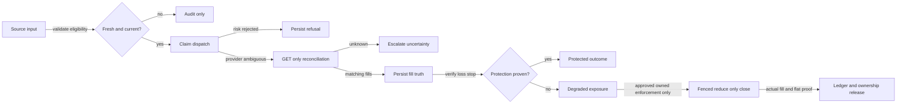

# Architecture

`Telegram source -> durable intake -> canonical analysis -> atomic fan-out -> isolated exchange dispatchers`

This document describes the remediation candidate, not blanket LIVE
readiness. See [release gates](docs/remediation-verification.md) and
[lessons](docs/LESSONS_LEARNED.md). Actual deployed mode, gates, schema and image
must be read back separately. During remediation, new Bitget entries and
fallback/stream mutations remain closed. A provider account being LIVE does not
mean entry execution is enabled.

## Source-to-execution boundaries

- Intake retains source history and independent catchup coverage. Source expiry,
  original captions and source revisions govern execution eligibility.
- Analysis uses bounded, explicitly authenticated subprocesses with no ambient
  DB/exchange/Telegram credentials. Database savepoints isolate bad messages.
- Canonical signal persistence and isolated per-exchange fan-out keep one
  interpretation separate from execution outcomes.
- Preflight validates symbol metadata, risk geometry, liquidation protection,
  provider exposure and fresh balance. Atomic PostgreSQL reservations fence
  margin, symbol ownership and position slots.
- A durable intent/client OID precedes POST. Ambiguous transport or missing detail
  invokes provider GET-only reconciliation, never a freshly renamed entry retry.
- Provider fills determine execution truth. Verified stop protection is a
  separate state; FILLED is not equivalent to PROTECTED.

## Native and fallback protection

Native position TPSL is the primary design. Documented omitted execute-price
fields retain market semantics after strict market-only validation. Generic
`43011` parameter validation must not be classified as unsupported capability.
Verify pending plans by exact symbol, side, trigger, quantity, identity and market
order type; placement acknowledgement alone is insufficient.

A fallback registry row does not prove active protection. Enforcement additionally
requires explicit mutation authorization, fresh observations, durable owned
position epoch/environment and a fenced reduce-only close intent. Old rows may
not act on replacement/manual positions. Unknown/malformed provider reads cannot
terminalize a close or release admission ownership.

Close submissions are not immediately declared filled. Actual matching provider
fills drive economic accounting, confirmed owned flatness drives final recovery,
and verified-close evidence controls release of consumed ownership.

## Risk and lanes

Sizing uses configured policy and strict exchange precision/minimum validation;
this document does not override the configured allocation, leverage, caps or
canary gate. Margin and position ownership commitments include in-flight work.
PAPER accounting/replay is a separate non-LIVE lane and must not claim measured
LIVE performance or rewrite historical realized PnL during deployment.

## End-to-end diagrams

### Components

### Execution sequence

### Failure decisions

Diagrams describe contracts and failure boundaries. Their presence does not
replace tests, independent review, exact CI SHA or authenticated runtime checks.
