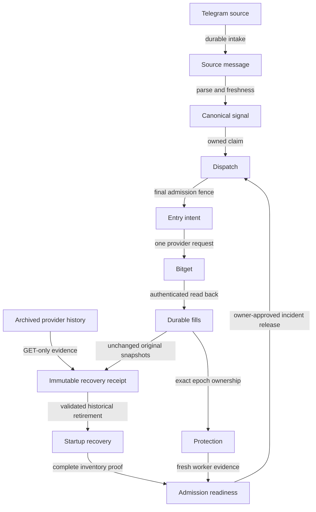

# Controlled historical recovery — operating contract

This document defines the approved repair boundary, not an assertion that production is repaired. The owner authorized controlled historical reconciliation and incident release after complete verification. Keep the permanent [LIVE-only policy](PRODUCTION-LIVE-POLICY.md). Historical instructions to deploy DEMO or execution=0 do not apply.

## Why restart alone cannot recover this installation

The initial live inspection found the dispatcher restarting before its polling loop: GET-only entry lifecycle recovery returns unresolved historical ownership. Seventeen positive-filled ENTRY intents require a decision: thirteen lack joined reservation/dispatch ownership, and four have consumed legacy reservations with NULL environment. Four FILLED dispatches retain `recovery-missing-protection:owned-flat-close-fill-unproven`. Two legacy fallback records also lack canonical environment/epoch. These records must not be deleted or excluded from admission accounting merely to make startup green.

A flat authenticated provider inventory proves current exposure only. It does not prove which historical fill closed which position lifetime. Existing verified-close binding captures requested ownership before a close POST; it must not be reused as retrospective historical ownership. Imported close-intent creation timestamps may be later than provider fills and must never be rewritten to satisfy canonical close guards.

## Data and recovery flow



```mermaid
sequenceDiagram
    participant Owner
    participant Operator
    participant Provider as Bitget GET
    participant DB as PostgreSQL
    participant Worker
    Owner->>Operator: Controlled recovery approval
    Operator->>DB: Read-only inventory and verified backup
    Operator->>Provider: Bounded complete historical reads
    Provider-->>Operator: Original envelopes, IDs, economics and epochs
    Operator->>Operator: Validate ownership; real-DB tests; independent review
    alt Evidence complete and reviewed
        Operator->>DB: Additive immutable historical receipt under venue fence
        Operator->>DB: Exact target read-back
        Worker->>DB: Validate receipt against unchanged original records
        Worker->>Provider: Fresh account/order/protection reads
        Worker-->>Operator: Startup and actual stream readiness evidence
        Operator->>DB: Approved exact-incident audited release
        Operator->>DB: Read back release; observe no relatch
    else Missing or ambiguous evidence
        Operator-->>Owner: Concrete blocker; preserve incident and original records
    end
```

## Required historical proof

- Authenticate provider account identity and LIVE environment; a client-OID prefix is not environment proof.
- Record bounded nonoverlapping query windows, cursor requests, original response envelopes and source-specific terminal-page contracts. A failed query is never an empty page.
- Validate exact entry order/client identities, actual provider fill sets, quantities, side, position lifetime and complete close allocations. Opposite side, same symbol, equal quantity or nearby timestamps alone do not authorize retirement.
- Preserve raw price, fees, PnL and timestamps. Historical endpoints can provide more precision than existing ledger rows; no silent quantization or rewriting to create equality.
- Make receipt and fill claims immutable and prevent reuse of one fill for competing epochs. Bind original intent, reservation, legacy admission binding and fallback identities where present.
- Treat a receipt as valid only while the original evidence it binds still matches. A mutated owner or additional contradictory fills must restore the veto.
- Missing, partial, foreign-account, cross-epoch, malformed or uncertain evidence must refuse apply and remain visible in readiness/admission accounting.

## Verification and rollout gates

1. Work in isolated clones; never source the production `.env` into tests. Preserve concurrent/unrelated work.
2. Reproduce defects with failing tests before applying code, then run the full suite with real disposable Unix-socket PostgreSQL. Skipped DB proofs are unexecuted, not passed.
3. Prove history/fill anti-reuse, rollback, idempotency, migration upgrade, concurrent admission/release serialization and GET-only restart behavior.
4. Require an independent fail-closed review on the exact integrated revision. A component review is not final activation approval.
5. Commit and push reviewed changes; verify remote SHA. Back up the production database, inspect the archive and rehearse restoration without exposing a database port.
6. Run the rendered production policy checker. Build intended services from the reviewed revision; retain LIVE/LIVE/1 and all incident/safety fences. Recreate rather than restart copied-source images.
7. Apply only proven bounded historical receipts. Read back each exact target; do not force canonicalization of competing legacy same-symbol owners.
8. Verify migration state, actual container environment/source hashes and service-owned progress independently.
9. Release only the exact approved incidents after historical ledger readiness, clean authenticated inventory, credible bounded-uncertainty clock evidence and actual-worker authenticated stream liveness pass. Recheck incident identity transactionally before release.
10. Read back switches and observe subsequent cycles. Runtime PASS means all named gates pass; it is not a provider fill.

## Liveness versus safety

A completed idle or policy-rejected worker cycle is liveness evidence, not permission to trade. A configuration-only healthcheck must not report a worker that has not completed startup as ready. Heartbeats, owner identity and stale/dead/restarted-worker tests remain independent of historical receipt/protection checks.

Clock sampling must not classify HTTP round-trip delay as host clock skew. Use latency/uncertainty-bounded sampling; an inconclusive read remains fail-closed but must not masquerade as proven offset. Private-stream release evidence must refer to the actual running worker, not merely a second successfully authenticated connection.

## Rollback and unresolved evidence

Keep the verified dump and prior source/image identity outside Git. A code rollback does not undo an append-only receipt. Additive schema must preserve original records and should be compatible with older readers failing closed. Restore a production database only with a separate intentional restore operation and account reconciliation; never overwrite newer live activity blindly.

If historical proof cannot be established through authenticated APIs, retain the veto and document precisely which account export or provider evidence is required. Owner approval authorizes work, not fabricated attribution.

## Fresh-source acceptance

Never replay the expired queued message as a smoke test. Re-enable admission only after all proofs above. Trace the next fresh eligible source through canonical signal, dispatch, durable intent, provider order/fills and verified protection. If no new eligible source arrives during observation, report readiness as verified and live copy-fill as not yet observed; do not manufacture an entry to claim success.
