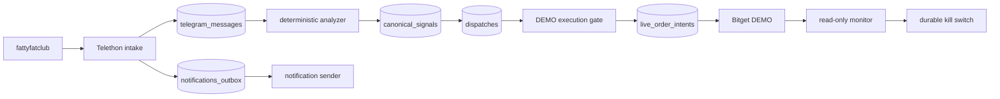

# DEMO Copy-Trade Operations

**Repository:** `fatty-multi-exchange-trader`
**Host:** `fspmi-hostinger`
**Source:** [`https://t.me/fattyfatclub`](https://t.me/fattyfatclub)
**Venue:** Bitget USDT Futures DEMO

> **HISTORICAL DOCUMENT** — This report reflects the state before the LIVE cutover (2026-09-08). The Bitget lane is now LIVE with a bounded canary. See `FULL-REPORT-BITGET-LIVE-20260908.md` for current state.

## Safety contract

- `TRADER_MODE=DEMO`
- `BITGET_MODE=DEMO`
- `BITGET_EXECUTION_ENABLED=0` until the operator explicitly authorizes bounded DEMO mutation.
- LIVE mode and real-money orders are forbidden for this operating track.
- Mode mismatch is rejected before the Bitget client/runtime is constructed.
- The Bitget monitor is read-only and latches the kill switch on unexpected provider state.

## Current read-only account evidence

Captured from the authenticated Bitget DEMO API on 2026-09-07:

```text
available      100 USDT
equity         100 USDT
margin mode    isolated
position mode  one_way_mode
positions      0
open orders    0
fills          0
probe          PASS
```

The health report now obtains these values directly from a sanitized read-only DEMO probe. Empty local `balance_snapshots` and `position_snapshots` no longer make a healthy DEMO account appear unavailable.

## End-to-end flow



## Telegram reporting

There are two periodic reports:

1. `operator-bot`: durable heartbeat every `21600` seconds (6 hours).
2. `fatty-health-report.timer`: host health report every 6 hours.

Historical `PAPER/LIVE` heartbeat rows remain in PostgreSQL for audit history. Current runtime heartbeat rows are `DEMO/DEMO`; historical rows must not be treated as current state.

The health report separates:
- provider read-only DEMO account telemetry;
- local database snapshots;
- local execution state;
- Codex quota telemetry.

`Codex Usage LIVE` means the quota API response is fresh; it does not mean trading is LIVE.

## Hardening implemented

- durable intent states/roles accepted by runtime and database constraints;
- additive migration v6 for intent constraints;
- bounded canary symbol enforcement;
- atomic PostgreSQL canary reservation and migration v7;
- durable source-forward outbox deduplication;
- unique notification claim tokens for overlapping workers;
- malformed autonomous-worker checkpoint recovery;
- mode mismatch fail-closed validation;
- strict mypy and regression tests.

## Operational verification

```bash
cd /home/valarion/apps/fatty-multi-exchange-trader

docker compose ps

docker compose --env-file .env --env-file .env.bitget-demo \
  run --rm --no-deps -e BITGET_MODE=DEMO \
  --entrypoint /app/.venv/bin/python dispatcher-bitget \
  /app/scripts/bitget_api_probe.py --json

bash scripts/telegram_health_report.sh
```

Before any DEMO mutation, require a fresh read-only probe, account/mode verification, no active kill switch, a positive bounded canary policy, and a read-back verification plan. Do not infer provider execution from a green parser or heartbeat.

## Known limitations

- The source database currently contains six persisted source messages; missing source messages are not fabricated.
- Provider mutation remains closed (`BITGET_EXECUTION_ENABLED=0`).
- Historical outbox rows are retained and may contain superseded labels; inspect timestamps and runtime environment together.
