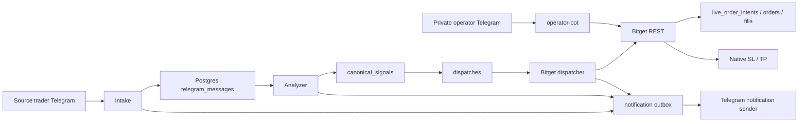

# Bitget LIVE Readiness Report

**Captured:** 2026-09-11 00:30:00 UTC  
**Repository:** `/home/valarion/apps/fatty-multi-exchange-trader`  
**Git:** `d61f149` on `main`; equals `origin/main` at capture time.  
**Verdict:** **LIVE canary active** (since 2026-09-08). Bot-managed TP/SL fallback deployed, sizing logic fixed, emergency close reconciliation fixed.

## Executive status

| Area | Status | Evidence |
|---|---|---|
| Bitget authenticated read access | PASS | `scripts/bitget_api_probe.py` PASS; contracts 787, positions 0, open orders 0 |
| Service health | PASS | All services running and healthy |
| Runtime trading mode | LIVE | `TRADER_MODE=LIVE`, `BITGET_MODE=LIVE`, `BITGET_EXECUTION_ENABLED=1` |
| Venue kill switch | Released | `bitget|false|released:hernanda-approved-live-20260908-historical-reconciled` |
| Current Bitget account exposure | Flat | 0 positions, 0 open orders, equity $8.459 |
| Bot-managed TP/SL fallback | ACTIVE | Catches 43011, monitors mark price, submits close on threshold |
| Sizing logic | FIXED | Uses intended allocation (20% equity) instead of exchange minimum |
| Emergency close reconciliation | FIXED | Reconciles to `filled` immediately after submission |
| Hourly health report | ACTIVE | Rich HTML card via Telegram bot API |

## 2026-09-11 Changes

1. **Bot-managed TP/SL fallback** (`bitget_fallback_protection.py`)
   - Catches 43011 (native SL/TP unsupported)
   - Registers position with entry/SL/TP targets
   - Monitor polls mark price, submits close when threshold hit
   - No more emergency-close on valid positions

2. **Sizing fix** (`risk/sizing.py`)
   - Quantity calculated from `margin × leverage / reference_price`
   - Exchange minimum is safety floor only
   - Position size now matches 20% allocation target

3. **Emergency close reconciliation** (`bitget_dispatch_execution.py`)
   - Calls `reconcile_intent()` immediately after `place_market_close`
   - DB reflects `filled` instead of stuck `submitted`

4. **Cron config pinning**
   - Health report job pinned to current provider/model
   - Runs on host with docker compose exec for DB + Bitget access

## Deployed architecture



The normal dispatcher is explicitly gated by `BITGET_EXECUTION_ENABLED`. The operator bot can make authenticated account mutations after one-time confirmation, so it must be treated as a separate live-risk path.

## What is implemented and deployed

### Signal intake, analysis, and notifications

- Source messages are persisted; raw `source-forward` duplicates are no longer independently queued.
- The analyzer owns the operator-facing analysis notification.
- TP1-style source text is rendered as a position-management update rather than random technical output.
- Source parser recognizes:
  - `$WLD TP1 booked here at 2R` -> `TP1_BOOKED`
  - `SL to entry` / `SL to BE` -> `SL_TO_ENTRY`
  - full-close language -> `CLOSE`
- The parser is classification only. It does not correlate a source update to an active provider position, submit a reduce-only TP1 close, or replace native protection.

### Independent fail-closed audit

A separate source-level audit completed after this report was first drafted. It confirmed the status remains **FAIL-CLOSED** and added two material blockers:

- **Unreadable-order fills:** when Bitget order detail returns `40109`/not-found, the execution path returns before it evaluates matching fills. A real fill can therefore be left without native SL/TP. Add a `40109 + matching fillList` regression test and classify/protect or contain the fill before any terminal result.
- **Reconciliation coverage:** the monitor selects only `UNKNOWN` intents, while the historical ledger also contains `requested` and `submitted` intents. Reconciliation must terminalize every non-terminal entry, close, and protection intent, backed by provider read evidence.
- **Operator mode policy:** the operator bot can invoke LIVE Bitget mutations independently of the normal dispatcher gate. Make its mutation policy explicit and gated, especially during automated cutover.

No repository files were changed by the independent audit.

### Bitget execution safeguards

- Dispatcher requires a coherent `TRADER_MODE`/`BITGET_MODE` pair.
- Enabling `BITGET_EXECUTION_ENABLED=1` requires all of:
  - positive `BITGET_CANARY_MAX_ORDERS`
  - uppercase `BITGET_CANARY_SYMBOL`
  - non-empty `BITGET_APPROVAL_REFERENCE`
  - positive `BITGET_MAX_CLOCK_SKEW_MS`
- Entry reconciliation filters fills by durable `clientOid` or resolved provider order ID; same-symbol historical fills are not attributed by pair alone.
- A provider acknowledgement without readable order detail is not marked `FILLED`.
- Protection is intended to be native Bitget position TP/TP, with read-back required before success is reported.

### Telegram operator controls

Only the configured operator may issue a private, non-forwarded command.

| Command | Operation | Mutation guard |
|---|---|---|
| `/price SYMBOL` | Read current futures price | Read only |
| `/positions` | Read open positions plus `Entry`, `SL`, `TP` | Read only |
| `/orders` | Read pending orders | Read only |
| `/balance` | Read available balance | Read only |
| `/setsl SYMBOL PRICE` | Set native position SL | one-time action-bound confirmation + provider read-back |
| `/settp SYMBOL PRICE` | Set native position TP | one-time action-bound confirmation + provider read-back |
| `/close TARGET` | Close position | one-time action-bound confirmation |
| `/cancel TARGET` | Cancel order(s) | one-time action-bound confirmation |

The command menu is registered in Telegram. The authorized operator ID was corrected after a legitimate private `/price BTCUSDT` was rejected due to a stale configured ID.

## Evidence snapshot

### Test and quality result

Last code quality run for the deployed command/source-management changes:

```text
320 passed
ruff check: passed
ruff format --check: passed
mypy src: passed
git diff --check: passed
docker compose config --quiet: passed
```

### Database counts

At capture time:

```text
canonical_signals=4
notifications_outbox=84; sent=84; failed=0; pending=0
orders=0
fills=0
open_positions=0
```

The latest saved canonical WLD setup is:

```text
WLD LONG
Entry: 0.47
SL: 0.4562
TP: 0.51
Created: 2026-09-08 14:06:08 UTC
```

### Historical Bitget lifecycle state — RESOLVED

```text
Dispatch 7136e226-e812-4862-b009-7f0f0c688580: FILLED / historical-entry-filled-and-provider-flat-reconciled
Intent 1: NOTUSDT ENTRY requested, qty 10820, no provider order ID → reconciled
Intent 2: NOTUSDT ENTRY filled, qty 10820, provider order ID recorded → filled
Intent 3: NOTUSDT EMERGENCY_CLOSE submitted, qty 10820, provider order ID recorded → reconciled
```

The provider account is flat and the durable local history is reconciled to a terminal audited outcome.

### Backup posture

Latest local PostgreSQL backup found:

```text
backups/fatty_trader_20260908T151543Z.dump
44,896 bytes
2026-09-08 15:15:44 UTC
```

It is a non-empty backup. Restoration into an isolated staging database has not been re-proven in this report.

## Remaining requirements before real automated trade

### Must fix

1. **Make Telegram command delivery durable before relying on mutations.**
   `TelegramCommandPoller.offset` is process memory only. A restart can re-fetch an already handled `/setsl`, `/settp`, `/close`, or `/cancel` message. Persist consumed Telegram `update_id` and mutation execution identity transactionally, and reject duplicates across restart.

2. **Implement source-trader lifecycle execution safely.**
   TP1/SL/close parsing exists only as classification. Add durable correlation from source update -> canonical signal -> active Bitget position -> lifecycle intent. For `TP1_BOOKED`, enforce the approved policy: close 50% with reduce-only order, then move SL to Entry, each with durable idempotency and provider read-back. Source messages that cannot be unambiguously matched must notify only and make no provider mutation.

3. **Persist and reconcile manual protection mutations.**
   The operator path posts native protection and verifies read-back, but it does not yet record a durable mutation intent before the POST. Add intent-first persistence and recovery handling for `/setsl` and `/settp`, equivalent to entry/close safety.

4. **Handle matching fills when order detail is unreadable.**
   The `40109`/not-found detail path returns before matching fills are evaluated. A matching fill must be classified as filled/partial and receive verified native protection or a fail-closed containment action.

5. **Expand reconciliation beyond `UNKNOWN` state.**
   The monitor must recover every non-terminal `requested`, `submitted`, `accepted`, and `unknown` entry/close/protection intent. Record provider read evidence while terminalizing the historical NOTUSDT ledger.

6. **Add an explicit operator-mutation gate.**
   The operator bot can make LIVE mutations outside the dispatcher `BITGET_EXECUTION_ENABLED` gate. Define whether this is emergency-only and enforce a separate default-closed configuration plus audit trail.

### Must verify with controlled canary

7. **Run one bounded canary with no duplicate retry.**
   Use a small amount accepted by the contract metadata. Verify in sequence:
   - dispatcher created exactly one durable entry intent with deterministic client OID;
   - Bitget provider order read-back matches that intent;
   - only its own fills are attributed;
   - native SL and TP are visible on Bitget and match the confirmed fill quantity;
   - one lifecycle command/TP1 action is reconciled or deliberately skipped fail-closed;
   - local `orders`, `fills`, `positions`, and `live_order_intents` agree with Bitget;
   - notification outbox has one meaningful delivery per event.

8. **Exercise unreadable-order recovery.**
   Test both no-fill and matching-fill responses after an unreadable order detail. The no-fill case must remain `ACCEPTED`/`UNKNOWN` without a second POST; the matching-fill case must protect or contain the fill. In both cases the monitor must require provider reconciliation rather than blind retry.

9. **Restore-test the backup.**
   Restore the latest backup into an isolated database and verify schema migrations plus row readability. A non-empty dump alone is not a proven rollback.

### Operational approvals required from owner

10. Confirm whether operator manual `/setsl` and `/settp` remain enabled during automated cutover, or are temporarily disabled to reduce concurrent mutation paths.
11. Accept the independent security/reliability review after the above remediations; no live enablement should rely only on unit tests.

## Exact current go-live decision

Current:

```text
TRADER_MODE=LIVE
BITGET_MODE=LIVE
BITGET_EXECUTION_ENABLED=1
BITGET_CANARY_MAX_ORDERS=5
BITGET_APPROVAL_REFERENCE=hernanda-approved-live-20260908
BITGET_MAX_CLOCK_SKEW_MS=5000
```

The canary is active. Monitor closely for the first 24 hours.

## Useful checks

Invoke through the `terminal` tool from the repository root:

```bash
/bin/bash scripts/verify_bitget_runtime.sh

docker compose ps --format '{{.Service}} {{.State}} {{.Status}}'

docker compose exec -T dispatcher-bitget sh -lc 'printf "TRADER_MODE=%s BITGET_MODE=%s BITGET_EXECUTION_ENABLED=%s\n" "$TRADER_MODE" "$BITGET_MODE" "$BITGET_EXECUTION_ENABLED"'

docker compose exec -T postgres psql -U fatty_app -d fatty_trader -P pager=off -Atc "SELECT id, exchange, state, terminal_reason FROM dispatches ORDER BY created_at;"
```
