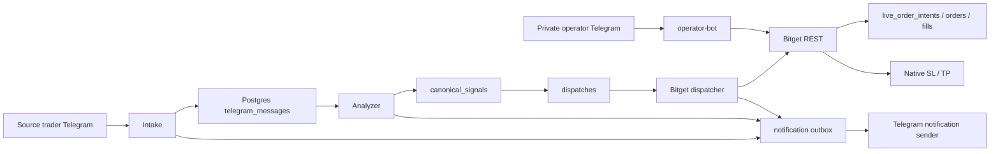

# Bitget LIVE Readiness Report

**Captured:** 2026-09-08 16:34:25 UTC  
**Repository:** `/home/valarion/apps/fatty-multi-exchange-trader`  
**Git:** `b27ed748f6a7cc39664a5b2cc6e7fb09da4bf90d` on `main`; equals `origin/main` at capture time.  
**Verdict:** **NOT approved to enable real automated entries.** The stack is LIVE-configured and read-only verified, but historical lifecycle state and mutation/idempotency gaps must be resolved first.

## Executive status

| Area | Status | Evidence |
|---|---|---|
| Bitget authenticated read access | PASS | `scripts/verify_bitget_runtime.sh` returned `runtime_check=PASS`; contracts 780, positions 0, open orders 0, fills endpoint readable. |
| Service health | PASS | `analyzer`, `dispatcher-bitget`, `intake`, `monitor-bitget`, `notification-sender`, `operator-bot`, `postgres`, and `web` were healthy/running. |
| Runtime trading mode | LIVE but closed | `TRADER_MODE=LIVE`, `BITGET_MODE=LIVE`, `BITGET_EXECUTION_ENABLED=0`. |
| Venue kill switch | Released | `bitget|false|released:user-request-not-signal-audit-20260907`. |
| Current Bitget account exposure | Flat | Read probe: 0 positions and 0 open orders. Local DB: 0 open positions and 0 orders. |
| Telegram operator interface | PASS for read paths | Telegram command menu registered: `price,positions,orders,balance,setsl,settp,close,cancel`. Verified `/price BTCUSDT` and `/price WLDUSDT` through the authenticated command service. |
| Automated source management | NOT READY | Parser recognizes TP1 / SL-to-entry / close text but does not submit a lifecycle action. |
| Historical lifecycle reconciliation | BLOCKED | One `UNKNOWN` Bitget dispatch and three non-terminal/relevant live intents remain. |

## Deployed architecture



The normal dispatcher is explicitly gated by `BITGET_EXECUTION_ENABLED`. The operator bot can make authenticated account mutations after one-time confirmation, so it must be treated as a separate live-risk path.

## What is implemented and deployed

### Signal intake, analysis, and notifications

- Source messages are persisted; raw `source-forward` duplicates are no longer independently queued.
- The analyzer owns the operator-facing analysis notification.
- TP1-style source text is rendered as a position-management update rather than random technical output.
- Source parser recognizes:
  - `$WLD TP1 booked here at 2R` -> `TP1_BOOKED`
  - `SL to entry` / `SL to BE` -> `SL_TO_ENTRY`
  - full-close language -> `CLOSE`
- The parser is classification only. It does not correlate a source update to an active provider position, submit a reduce-only TP1 close, or replace native protection.

### Independent fail-closed audit

A separate source-level audit completed after this report was first drafted. It confirmed the status remains **FAIL-CLOSED** and added two material blockers:

- **Unreadable-order fills:** when Bitget order detail returns `40109`/not-found, the execution path returns before it evaluates matching fills. A real fill can therefore be left without native SL/TP. Add a `40109 + matching fillList` regression test and classify/protect or contain the fill before any terminal result.
- **Reconciliation coverage:** the monitor selects only `UNKNOWN` intents, while the historical ledger also contains `requested` and `submitted` intents. Reconciliation must terminalize every non-terminal entry, close, and protection intent, backed by provider read evidence.
- **Operator mode policy:** the operator bot can invoke LIVE Bitget mutations independently of the normal dispatcher gate. Make its mutation policy explicit and gated, especially during automated cutover.

No repository files were changed by the independent audit.

### Bitget execution safeguards

- Dispatcher requires a coherent `TRADER_MODE`/`BITGET_MODE` pair.
- Enabling `BITGET_EXECUTION_ENABLED=1` requires all of:
  - positive `BITGET_CANARY_MAX_ORDERS`
  - uppercase `BITGET_CANARY_SYMBOL`
  - non-empty `BITGET_APPROVAL_REFERENCE`
  - positive `BITGET_MAX_CLOCK_SKEW_MS`
- Entry reconciliation filters fills by durable `clientOid` or resolved provider order ID; same-symbol historical fills are not attributed by pair alone.
- A provider acknowledgement without readable order detail is not marked `FILLED`.
- Protection is intended to be native Bitget position TP/SL, with read-back required before success is reported.

### Telegram operator controls

Only the configured operator may issue a private, non-forwarded command.

| Command | Operation | Mutation guard |
|---|---|---|
| `/price SYMBOL` | Read current futures price | Read only |
| `/positions` | Read open positions plus `Entry`, `SL`, `TP` | Read only |
| `/orders` | Read pending orders | Read only |
| `/balance` | Read available balance | Read only |
| `/setsl SYMBOL PRICE` | Set native position SL | one-time action-bound confirmation + provider read-back |
| `/settp SYMBOL PRICE` | Set native position TP | one-time action-bound confirmation + provider read-back |
| `/close TARGET` | Close position | one-time action-bound confirmation |
| `/cancel TARGET` | Cancel order(s) | one-time action-bound confirmation |

The command menu is registered in Telegram. The authorized operator ID was corrected after a legitimate private `/price BTCUSDT` was rejected due to a stale configured ID.

## Evidence snapshot

### Test and quality result

Last code quality run for the deployed command/source-management changes:

```text
320 passed
ruff check: passed
ruff format --check: passed
mypy src: passed
git diff --check: passed
docker compose config --quiet: passed
```

### Database counts

At capture time:

```text
canonical_signals=4
notifications_outbox=84; sent=84; failed=0; pending=0
orders=0
fills=0
open_positions=0
```

The latest saved canonical WLD setup is:

```text
WLD LONG
Entry: 0.47
SL: 0.4562
TP: 0.51
Created: 2026-09-08 14:06:08 UTC
```

### Historical Bitget lifecycle state — blocking evidence

```text
Dispatch 7136e226-e812-4862-b009-7f0f0c688580: UNKNOWN / provider-unknown
Intent 1: NOTUSDT ENTRY requested, qty 10820, no provider order ID
Intent 2: NOTUSDT ENTRY filled, qty 10820, provider order ID recorded
Intent 3: NOTUSDT EMERGENCY_CLOSE submitted, qty 10820, provider order ID recorded
```

The current provider account is flat, but the durable local history is not reconciled to a terminal audited outcome. Enabling automated entries before reconciling this would make recovery and duplicate-prevention claims unreliable.

### Backup posture

Latest local PostgreSQL backup found:

```text
backups/fatty_trader_20260908T151543Z.dump
44,896 bytes
2026-09-08 15:15:44 UTC
```

It is a non-empty backup. Restoration into an isolated staging database has not been re-proven in this report.

## Remaining requirements before real automated trade

### Must fix

1. **Reconcile the historical NOTUSDT incident.**
   Determine the provider outcome for the requested entry, filled entry, and submitted emergency close. Persist an explicit terminal reconciliation result for the `UNKNOWN` dispatch and all three intents. Do not delete history to make counts look clean.

2. **Make Telegram command delivery durable before relying on mutations.**
   `TelegramCommandPoller.offset` is process memory only. A restart can re-fetch an already handled `/setsl`, `/settp`, `/close`, or `/cancel` message. Persist consumed Telegram `update_id` and mutation execution identity transactionally, and reject duplicates across restart.

3. **Implement source-trader lifecycle execution safely.**
   TP1/SL/close parsing exists only as classification. Add durable correlation from source update -> canonical signal -> active Bitget position -> lifecycle intent. For `TP1_BOOKED`, enforce the approved policy: close 50% with reduce-only order, then move SL to Entry, each with durable idempotency and provider read-back. Source messages that cannot be unambiguously matched must notify only and make no provider mutation.

4. **Persist and reconcile manual protection mutations.**
   The operator path posts native protection and verifies read-back, but it does not yet record a durable mutation intent before the POST. Add intent-first persistence and recovery handling for `/setsl` and `/settp`, equivalent to entry/close safety.

5. **Handle matching fills when order detail is unreadable.**
   The `40109`/not-found detail path returns before matching fills are evaluated. A matching fill must be classified as filled/partial and receive verified native protection or a fail-closed containment action.

6. **Expand reconciliation beyond `UNKNOWN` state.**
   The monitor must recover every non-terminal `requested`, `submitted`, `accepted`, and `unknown` entry/close/protection intent. Record provider read evidence while terminalizing the historical NOTUSDT ledger.

7. **Add an explicit operator-mutation gate.**
   The operator bot can make LIVE mutations outside the dispatcher `BITGET_EXECUTION_ENABLED` gate. Define whether this is emergency-only and enforce a separate default-closed configuration plus audit trail.

### Must verify with controlled canary

8. **Set a fresh cutover record only after items 1–7 are merged and deployed.**
   Supply a real approval reference and configure one supported, uppercase LIVE `BITGET_CANARY_SYMBOL`, a positive one-order cap, a tested clock-skew bound, and `BITGET_EXECUTION_ENABLED=1` only for the canary window.

9. **Run one bounded canary with no duplicate retry.**
   Use a small amount accepted by the contract metadata. Verify in sequence:
   - dispatcher created exactly one durable entry intent with deterministic client OID;
   - Bitget provider order read-back matches that intent;
   - only its own fills are attributed;
   - native SL and TP are visible on Bitget and match the confirmed fill quantity;
   - one lifecycle command/TP1 action is reconciled or deliberately skipped fail-closed;
   - local `orders`, `fills`, `positions`, and `live_order_intents` agree with Bitget;
   - notification outbox has one meaningful delivery per event.

10. **Exercise unreadable-order recovery.**
   Test both no-fill and matching-fill responses after an unreadable order detail. The no-fill case must remain `ACCEPTED`/`UNKNOWN` without a second POST; the matching-fill case must protect or contain the fill. In both cases the monitor must require provider reconciliation rather than blind retry.

11. **Restore-test the backup.**
   Restore the latest backup into an isolated database and verify schema migrations plus row readability. A non-empty dump alone is not a proven rollback.

### Operational approvals required from owner

12. Confirm the canary symbol, maximum exposure/order, and `BITGET_APPROVAL_REFERENCE` immediately before enabling execution.
13. Confirm whether operator manual `/setsl` and `/settp` remain enabled during automated cutover, or are temporarily disabled to reduce concurrent mutation paths.
14. Accept the independent security/reliability review after the above remediations; no live enablement should rely only on unit tests.

## Exact current go-live decision

Keep:

```text
TRADER_MODE=LIVE
BITGET_MODE=LIVE
BITGET_EXECUTION_ENABLED=0
```

Do **not** change `BITGET_EXECUTION_ENABLED` to `1` until every **Must fix** item is complete and the controlled-canary verification is prepared. The account is currently flat and read access is healthy, so there is no operational reason to rush the unsafe transition.

## Useful checks

Invoke through the `terminal` tool from the repository root:

```bash
/bin/bash scripts/verify_bitget_runtime.sh

docker compose ps --format '{{.Service}} {{.State}} {{.Status}}'

docker compose exec -T dispatcher-bitget sh -lc 'printf "TRADER_MODE=%s BITGET_MODE=%s BITGET_EXECUTION_ENABLED=%s\n" "$TRADER_MODE" "$BITGET_MODE" "$BITGET_EXECUTION_ENABLED"'

docker compose exec -T postgres psql -U fatty_app -d fatty_trader -P pager=off -Atc "SELECT id, exchange, state, terminal_reason FROM dispatches ORDER BY created_at;"
```
