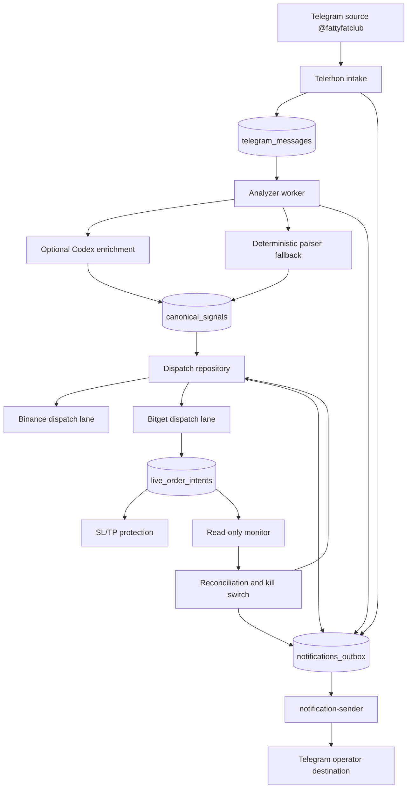
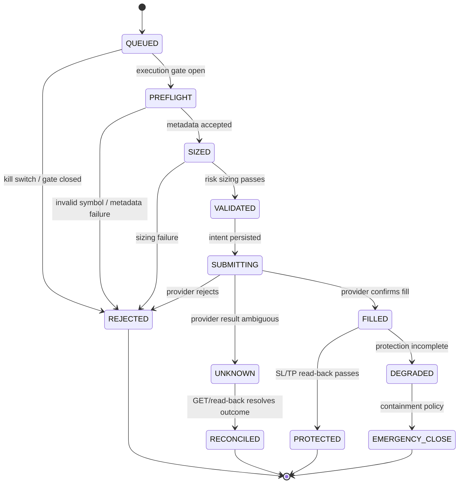

# Fatty Multi-Exchange Trader — Full Project Report

**Report path:** `C:\Workspace\bots\fatty-bitget-live\docs\FULL-REPORT-fatty-multi-exchange-trader-20260906.md`  
**Generated:** 2026-09-06T14:51:42Z  
**Repository:** `fatty-multi-exchange-trader`  
**Deployment target:** `fspmi-hostinger`  
**Deployment path:** `/home/valarion/apps/fatty-multi-exchange-trader`  
**Current repository head:** `e8838977c988ee5609572be41d2dd4fa4cf307c1` (`fix: restore rich heartbeat telegram cards`)

> This is an evidence-based state report. Secrets, bot tokens, Telegram target IDs, API keys, passphrases, session files, and connection strings are intentionally omitted or represented as `[REDACTED]`.

---

## 1. Executive summary

Fatty Multi-Exchange Trader is a **PAPER-first Telegram signal intake and controlled multi-venue dispatch system**. It consumes messages from `@fattyfatclub`, stores raw source messages durably in PostgreSQL, parses/analyzes them into canonical trade signals, creates independent venue dispatches, and emits operational telemetry to a configured Telegram operator destination through a durable notification outbox.

The current production deployment is healthy at the process/container level and is intentionally **not allowed to submit live Bitget orders**.

### Current verified state

| Area | State | Evidence |
|---|---:|---|
| Existing production host preserved | PASS | `fspmi-hostinger`, existing Compose project and PostgreSQL retained |
| Current deployed commit | PASS | `e8838977c988ee5609572be41d2dd4fa4cf307c1` |
| PostgreSQL | PASS | PostgreSQL 16.15, Compose health `healthy` |
| Compose services | PASS | 8 services running and healthy |
| Telegram intake | PASS | 4 stored source messages, all `ANALYZED` |
| Telegram operator delivery | PASS | outbox records sent; sender healthy |
| Rich Telegram HTML formatter | PASS in code | `parse_mode=HTML`, escaped values, literal newlines, `<b>/<i>/<pre>/<code>` |
| Heartbeat configured cadence | PASS | running container has `TELEGRAM_HEARTBEAT_SECONDS=21600` (6 hours) |
| Old one-minute heartbeat history | PRESENT, not current cadence | stale pre-rollout outbox records remain in PostgreSQL history |
| Analyzer fallback | PASS | deterministic parser works; Codex container capability remains unavailable |
| Canonical signal creation | PASS | 1 canonical signal exists |
| Bitget authenticated read lane | PASS previously verified | mainnet read-only probes succeeded |
| Bitget execution | CLOSED | `BITGET_EXECUTION_ENABLED=0` |
| Bitget kill switch | LATCHED | `provider-orders-invalid` |
| Live order intents | ZERO | no live order intent rows |
| Live orders submitted | ZERO | no provider mutation performed |
| Bitget demo lane | BLOCKED | provider returned `40099: exchange environment is incorrect` |
| Full live readiness | BLOCKED | execution gate, kill switch, demo evidence, and Codex wiring remain unresolved |

### Bottom line

The system is currently **operational for intake, deterministic analysis, persistence, Telegram telemetry, read-only Bitget monitoring, and fail-closed dispatch behavior**. It is **not authorized or ready for live order submission**. That is the correct safety state.

---

## 2. Non-negotiable safety decisions

These constraints are part of the operational contract and must not be relaxed casually:

1. `TRADER_MODE` remains `PAPER`.
2. `BITGET_MODE=LIVE` only identifies the Bitget read-only venue context; it does not authorize order submission.
3. `BITGET_EXECUTION_ENABLED=0` remains enforced.
4. `BITGET_CANARY_MAX_ORDERS=0` remains closed.
5. The Bitget kill switch remains latched with reason `provider-orders-invalid`.
6. No live order has been submitted during parser, telemetry, heartbeat, or formatting work.
7. PostgreSQL data and the existing `fspmi-hostinger` deployment are preserved in place.
8. Every production rollout requires a PostgreSQL backup before rebuild/restart.
9. Dynamic signal pairs are accepted only after symbol-shape validation and Bitget metadata preflight.
10. A valid signal does not bypass sizing, exchange filters, risk limits, protection, reconciliation, or kill-switch controls.
11. Telegram payloads must not contain credentials, authorization headers, bot tokens, session material, or raw secrets.
12. The exposed Telegram bot token must be rotated through BotFather separately; the token is not reproduced in this report.

---

## 3. System purpose and operating model

### Intended flow



### Core trace chain

The production trace chain is:

```text
telegram_messages
  → canonical_signals
  → dispatches
  → live_order_intents
  → fills / position_snapshots / protection_states
  → notifications_outbox
  → notification-sender
  → Telegram operator chat
```

A source row marked `ANALYZED` is not by itself proof that a trade was created. The canonical signal, dispatch, intent, and outbox rows must be checked independently.

---

## 4. Repository and deployment lineage

### Local workspace

```text
C:\Workspace\bots\fatty-bitget-live
branch: main
HEAD: e8838977c988ee5609572be41d2dd4fa4cf307c1
remote: origin/main
working tree: clean at report creation
```

### Important recent commits

| Commit | Meaning |
|---|---|
| `e883897` | Restore rich Telegram heartbeat cards and HTML report layout |
| `310cafe` | Reduce heartbeat cadence to six hours |
| `c207966` | Publish complete source, analyzer, dispatch, execution, and heartbeat telemetry |
| `43260c5` | Parse plural `TARGETS:` / `TPS:` source syntax |
| `8a2bdea` | Dynamic symbol-gate report documentation |
| `82263f6` | Replace static single-symbol Bitget gate with dynamic symbol validation and metadata preflight |
| `1ffdf68` | Use writable `backups/` directory for PostgreSQL dumps |
| `37bd227` | Preserve migration and notification-formatting gates |
| `b462ddb` | Durable dispatcher topology and observe-only behavior |
| `77627eb` | Native protection and emergency containment |
| `a3402c0` | Reconciliation and monitor repair |
| `3cfadec` | Async Bitget execution and restart-safe provider reconciliation |
| `46d4702` | Durable restart-safe Bitget live intents |

### Production continuity

The deployment was upgraded in place. No replacement host, new database, volume wipe, or fresh parallel production stack was used.

```text
Host: fspmi-hostinger
App:  /home/valarion/apps/fatty-multi-exchange-trader
Compose services: analyzer, dispatcher-bitget, intake, monitor-bitget,
                  notification-sender, operator-bot, postgres, web
```

The host working tree was at the same commit as local `origin/main` when this report was generated. The only untracked host path observed was `backups/`, which is expected operational backup storage and is not source code.

---

## 5. Production topology

### Services

| Service | Role | Current state |
|---|---|---|
| `postgres` | Durable application state and outbox | healthy |
| `intake` | Telethon source listener, raw persistence, source relay | healthy / ready |
| `analyzer` | Reads `RECEIVED` rows, deterministic/Codex analysis, canonical signal creation | healthy / ready |
| `dispatcher-bitget` | Claims Bitget dispatches; closed by execution gate | healthy / idle |
| `monitor-bitget` | Authenticated read-only provider reads and reconciliation safety state | healthy / kill-switch-latched |
| `notification-sender` | Claims and delivers Telegram outbox notifications | healthy / idle when queue empty |
| `operator-bot` | Publishes DB-backed heartbeat summaries | healthy / heartbeat-published |
| `web` | Sanitized health/read-only service surface | healthy |

### Current service evidence

The production Compose status readback showed all eight services `running` and `healthy`.

Representative current logs:

```text
service=intake mode=PAPER state=ready
service=analyzer mode=PAPER state=ready processed=0 codex_cli=unavailable codex_account=UNCONFIGURED
service=dispatcher-bitget mode=PAPER venue_mode=LIVE state=idle
service=monitor-bitget mode=PAPER venue_mode=LIVE state=kill-switch-latched reasons=provider-orders-invalid
service=notification-sender state=idle
service=operator-bot state=heartbeat-published latest_message_id=16096 raw=4 signals=1 dispatches=2 intents=0
```

The analyzer reporting `processed=0` during idle cycles is expected when there are no new `RECEIVED` rows. It is not evidence that the analyzer is broken; the durable database state must be checked alongside logs.

---

## 6. Database schema and current production data

### PostgreSQL

```text
PostgreSQL 16.15 on x86_64-pc-linux-musl
Database: fatty_trader
```

### Main tables

The deployed public schema currently includes:

```text
balance_snapshots
canonical_signals
dispatch_transitions
dispatches
fills
live_order_intents
notifications_outbox
orders
position_snapshots
positions
protection_states
reconciliation_state
schema_migrations
telegram_messages
venue_kill_switches
```

### Current counts

These values were read directly from the production PostgreSQL container at report creation:

| Table / metric | Count / state |
|---|---:|
| `telegram_messages` | 4 |
| `canonical_signals` | 1 |
| `dispatches` | 2 |
| `live_order_intents` | 0 |
| `notifications_outbox` | 16 |
| Source rows `ANALYZED` | 4 |
| Source rows `RECEIVED` | 0 |
| Source rows `FAILED` | 0 |
| Source rows `EXPIRED` | 0 |
| Outbox sent | 16 |
| Outbox failed | 0 |
| Outbox pending at readback | 0 |
| Active live-intent rows | 0 |

### Current source rows

| Message ID | Source channel | State | Meaning observed during diagnosis |
|---:|---:|---|---|
| `16090` | `-1001252615519` | `ANALYZED` | Actionable `$PUMP LONG`; entry `0.00427`, targets `0.004438`, `0.004915`, SL `0.00416` |
| `16091` | `-1001252615519` | `ANALYZED` | Profit-taking / stop-loss update; not a new entry |
| `16093` | `-1001252615519` | `ANALYZED` | `$BTC` market commentary; not a complete entry |
| `16096` | `-1001252615519` | `ANALYZED` | `$AIXBT` close/update commentary; not a new entry |

The channel ID and message IDs are operational trace identifiers, not credentials.

### Dispatch state

The two stored dispatches currently represent independent venue outcomes for the valid signal:

| Venue | State | Reason |
|---|---|---|
| Binance | `QUEUED` | Separate lane remains queued; no live intent was created |
| Bitget | `REJECTED` | `kill-switch-latched` |

The Bitget rejection is expected fail-closed behavior while the kill switch is latched. It is not evidence that parsing failed.

### Kill switch

```text
scope:    bitget
active:   true
reason:   provider-orders-invalid
```

The kill switch must not be cleared merely to advance a test or create a demo of execution.

---

## 7. Telegram intake and source processing

### Source

```text
Configured source: @fattyfatclub
Observed source channel ID: -1001252615519
```

The intake worker uses Telethon, persists the source message before forwarding, and includes a stable source reference in outbound telemetry:

```text
Source ID: -1001252615519:<message_id>
```

The source text is escaped before Telegram HTML delivery. Literal newlines are used; unsupported `<br>` tags were removed.

### Idempotency and persistence

Raw source records contain:

- channel ID;
- source message ID;
- revision hash;
- received timestamp;
- raw text;
- intake state.

The unique source key includes `(channel_id, message_id, revision_hash)`, so a message revision can be distinguished from a duplicate delivery.

### Analyzer behavior

The analyzer claims durable `RECEIVED` rows, attempts Codex enrichment if available, and falls back to deterministic parsing. It then records an `ANALYZED` or `FAILED` outcome and emits an analyzer telemetry event.

The deterministic fallback is intentionally independent from Codex. A missing Codex executable must reduce enrichment, not silently discard a geometrically valid signal.

### Parser issue found and fixed

The real `$PUMP LONG` source used plural syntax:

```text
TARGETS: 0.004438 - 0.004915
```

The old parser accepted only singular target forms. That created a false-green condition: the raw row was consumed and marked analyzed, but no canonical signal was created.

The parser now accepts:

- `TARGET:`
- `TARGETS:`
- `TP:`
- `TPS:`
- multiple target values separated by `-`, `,`, or `/`

A regression test was added from the actual message shape. After deployment, message `16090` produced one canonical signal and two dispatch rows.

---

## 8. Canonical signal and dispatch model

### Canonical signal contract

The canonical signal stores normalized trade geometry:

- source message reference;
- revision;
- pair token;
- direction (`LONG` or `SHORT`);
- positive entry price;
- positive stop loss;
- target values through the extended signal model;
- creation timestamp.

Signal geometry is validated before dispatch. Missing or invalid stop loss is not converted into a trade.

### Dynamic symbols

The original implementation compared every Bitget dispatch against one static canary symbol. That was incorrect because `@fattyfatclub` emits signals for many pairs.

The current dynamic gate:

1. validates the symbol against `^[A-Z0-9]{2,20}$`;
2. sends the symbol to Bitget metadata preflight;
3. obtains symbol-specific quantity step, minimum quantity, minimum notional, contract value, and leverage limits;
4. sizes and validates against that symbol's real constraints;
5. rejects invalid or unknown symbols without submitting an order.

The old `BITGET_CANARY_SYMBOL` equality restriction was removed from dispatch construction. The environment variable remains only as a legacy cutover placeholder and is still required if execution is explicitly enabled by the current safety validator.

### Dispatch state machine

The durable dispatcher uses database claims and leases. It is designed for multiple workers without duplicate claims.



### Closed behavior now

Because execution is disabled and the kill switch is active:

- the dispatcher may inspect queued rows;
- it may record a rejection and transition telemetry;
- it must not create a provider-mutating Bitget intent;
- it must not POST an entry, SL, TP, or close order.

---

## 9. Bitget execution architecture

The Bitget lane has two deliberately separate modes:

### Read-only monitor path

The monitor uses authenticated provider GET operations to inspect:

- account state;
- contract metadata;
- orders;
- fills;
- positions;
- server time / clock skew;
- reconciliation state.

This path is useful for proving credentials and observing the account, but it does not authorize order mutation.

### POST-capable execution path

The POST-capable graph is constructed only if every explicit gate passes. The graph includes:

1. Bitget REST client;
2. async venue adapter;
3. symbol metadata preflight;
4. durable live-intent store;
5. async execution adapter;
6. dispatch execution coordinator;
7. native protection and reconciliation;
8. emergency containment.

The current deployment does not construct or activate the POST-capable path because `BITGET_EXECUTION_ENABLED=0`.

### Durable live intents

Before any provider POST in an enabled future cutover, the design persists:

- exchange;
- client order ID;
- symbol;
- side;
- role (`ENTRY`, `SL`, `TP`, `CLOSE`);
- requested quantity and price;
- state;
- provider order ID once acknowledged;
- fill quantity, price, fee, and provider fill IDs;
- leverage and margin mode.

A restart must reconcile an existing durable intent by provider GET/read-back rather than issue a duplicate POST.

### Protection and containment

The implemented protection design includes:

- confirmed-fill protection;
- symbol-aware exact quantity;
- isolated margin validation;
- native SL/TP read-back;
- degraded protection latch;
- deterministic emergency-close client order ID;
- at-most-once emergency submission;
- flat-position skip;
- reconciliation-driven containment.

These capabilities are implementation evidence. They are not a substitute for a completed demo lifecycle and explicit human approval.

---

## 10. Telegram operator telemetry

### Delivery architecture

All important operator messages are written to `notifications_outbox` first. The separate `notification-sender` claims rows with PostgreSQL `FOR UPDATE SKIP LOCKED`, leases them, sends through the Telegram Bot API, and records `sent_at`, retry state, or `failed_at`.

The sender uses:

```text
parse_mode=HTML
disable_web_page_preview=true
```

The sender does not log tokens, response bodies, payloads, or raw transport exception text.

### Event classes

The telemetry contract covers:

- raw source forwarding;
- source channel/message IDs;
- analyzer success;
- analyzer fallback / Codex-unavailable classification;
- non-actionable analysis;
- parser rejection;
- canonical signal creation;
- dispatch creation;
- every dispatch state transition;
- kill-switch activation;
- execution rejection/fill/unknown outcomes;
- protection and reconciliation alerts;
- notification delivery failure;
- periodic heartbeat snapshots.

### Rich HTML heartbeat

The heartbeat formatter restores the approved card layout using safe Telegram HTML:

```html
<b>Fatty Signal Relay</b>  <i>Paper Ops</i>

<b>Status</b>
<pre>Overall  🟢 ONLINE
Mode     PAPER
Venue    LIVE
Host     fspmi-hostinger
Source   ...</pre>

<b>Latest Signal</b>
Message  <code>16096</code>
Received <code>...</code>

<b>Database</b>
<pre>Messages          4
Received          0
Analyzed          4
Failed            0
Signals           1
Dispatches        2
Live intents      0</pre>

<b>Notifications</b>
<pre>Pending           0
Failed            0</pre>

<b>Safety</b>
<pre>Mode              PAPER
Execution enabled 0
Codex account     UNCONFIGURED</pre>
```

The exact live payload may vary with current counters, but the formatter preserves the report structure and uses:

- `<b>` for section headings;
- `<i>` for the Paper Ops label;
- `<pre>` for aligned status blocks;
- `<code>` for identifiers;
- literal newline characters;
- HTML escaping for user/source content;
- token and secret redaction.

`<br>` is intentionally not used because Telegram HTML does not reliably accept it.

### Heartbeat cadence clarification

The current running container and Compose configuration both report:

```text
TELEGRAM_HEARTBEAT_SECONDS=21600
```

This is six hours. The current operator-bot code buckets deduplication with:

```python
heartbeat:{int(time.time() // interval)}
```

The production database still contains old one-minute heartbeat records with dedup keys such as `heartbeat:29811757`. Those rows were generated by the pre-six-hour implementation and remain durable history. They can make Telegram history appear to show minute-level heartbeats even after the current container is configured for six hours.

The current six-hour key shape is different, for example `heartbeat:82810`. Therefore:

- old one-minute rows are historical evidence;
- current cadence configuration is six hours;
- old outbox rows should not be mistaken for a current scheduler loop;
- a future cleanup/reconciliation decision may archive or label stale heartbeat history, but it must not delete audit history without explicit approval.

---

## 11. Codex capability: host versus analyzer container

This project has two distinct Codex environments.

### Host environment

The host has a Codex executable and authentication/usage files. The host-side health script can report subscription usage such as plan and quota windows.

### Analyzer container

The analyzer runs inside Docker. It currently reports:

```text
codex_cli=unavailable
codex_account=UNCONFIGURED
```

The container does not have the Codex executable in `PATH` and does not have the host's authentication files mounted into its runtime environment.

### Why this matters

Host-side Codex usage is not proof that the analyzer can invoke Codex. Reporting `Codex Usage LIVE` from the host while the analyzer reports `codex_cli=unavailable` is not necessarily contradictory; it describes two different execution contexts.

The safe current behavior is:

- report analyzer Codex capability as unavailable;
- use deterministic parser fallback;
- do not claim analyzer Codex enrichment is active;
- do not mount or copy host credentials without an explicit security design;
- if Codex is later wired, verify the executable and authentication inside the analyzer container itself.

---

## 12. Production backup and rollback posture

A PostgreSQL backup is taken before deployment changes. Recent verified backup artifacts include:

```text
backups/fatty_trader_20260906T142429Z.dump  33,470 bytes
backups/fatty_trader_20260906T143641Z.dump  34,305 bytes
backups/fatty_trader_20260906T144232Z.dump  34,401 bytes
```

The backup helper was repaired to:

- write to the user-writable `backups/` directory;
- pass the PostgreSQL username explicitly;
- reject empty dumps;
- preserve a restore command;
- remain outside Git-tracked source.

Rollback principle:

1. preserve the current deployed SHA;
2. preserve the pre-rollout dump path;
3. stop or rebuild only the affected Compose services where possible;
4. restore source via fast-forward-safe Git operations;
5. restore database only as an explicit destructive operation;
6. verify service health, schema migrations, kill switch, and execution gate after rollback.

---

## 13. Verification history

### Local validation achieved during implementation

The integrated project reached the following local gates during the work:

```text
pytest: 270 passed after telemetry/cadence work
pytest: 271 passed during the final rich-format rollout validation
Ruff check: passed
Ruff format: passed
Mypy: passed on 60 source files
Shell syntax checks: passed
Docker Compose config validation: passed
git diff --check: passed
```

The exact test count may increase as further tests are added; the important acceptance rule is zero failures and no unexplained suite-count regression.

### Production validation achieved

- Existing host selected and preserved.
- PostgreSQL backup created before deployment.
- Eight Compose services running and healthy.
- Database migrations applied through the deployed migration set.
- Mainnet Bitget authenticated read-only checks passed previously.
- Telegram bot identity verified previously with Bot API `getMe`.
- Telegram target chat verified previously with Bot API `getChat`.
- Notification sender delivered records with zero terminal failures in the latest readback.
- Raw source messages persisted and traceable.
- `$PUMP LONG` source reprocessed into one canonical signal.
- Bitget dispatch rejected by kill switch instead of submitting an order.
- No live-order intent rows created.

### Evidence tracks kept separate

| Evidence track | Result |
|---|---|
| Local unit/integration tests | PASS |
| Static quality gates | PASS |
| Docker image/Compose packaging | PASS |
| Deployed schema | PASS |
| Container/service runtime | PASS |
| Telegram outbox persistence | PASS |
| Telegram sender delivery | PASS |
| Bitget authenticated read-only | PASS previously verified |
| Bitget demo mutation lifecycle | BLOCKED by provider environment error |
| Live Bitget order smoke test | NOT RUN by design |
| Full live readiness | BLOCKED |

A green mock test or healthy container does not prove live order readiness.

---

## 14. Known issues and open blockers

### P0 safety blocks — must remain blocked

1. **Live execution is disabled**: `BITGET_EXECUTION_ENABLED=0`.
2. **Kill switch is latched**: `provider-orders-invalid`.
3. **Bitget demo environment is unavailable**: provider code `40099` indicated an environment mismatch.
4. **No explicit human live approval exists in the current state.**
5. **Telegram bot token rotation remains required** because the old token was exposed during earlier work. The value is intentionally absent from this report.

### P1 readiness gaps

1. Analyzer Codex is unavailable inside Docker. Deterministic fallback works, but container-side Codex enrichment is not active.
2. A complete demo lifecycle has not been proven against the correct Bitget demo environment.
3. A full protected fill → reconciliation → close lifecycle has not been executed with live provider mutations.
4. Seven-day/200-dispatch PAPER soak evidence is not recorded as a completed gate.
5. The current kill-switch diagnosis needs a separately authorized remediation procedure before clearing.
6. The Binance queued dispatch requires a deliberate policy decision; it must not be allowed to create unintended mutation when a venue is not intended to run.

### P2 observability/documentation gaps

1. Old one-minute heartbeat rows remain in the outbox and can confuse visual inspection of Telegram history. They are historical records, not evidence that the current six-hour scheduler is active.
2. Some older repository documents, particularly the original `IMPLEMENTATION-STATUS.md` and parts of `OPERATIONS.md`, describe the pre-production scaffold and are stale relative to the current deployed system. They should be annotated or updated in a separate documentation pass.
3. The current rich heartbeat card is intentionally compact; it does not yet include every balance, position, order, PNL, service-by-service line, and Codex quota field from the earlier approved host-side report. Those fields remain `N/A` when the backing snapshot tables have no data. Expanding the card must preserve HTML safety and Telegram message limits.
4. The destination is a private operator chat, not a broadcast channel. Changing it requires explicit target selection and a fresh `getChat` verification.

---

## 15. Recommended next actions, in order

### Immediate documentation/observability actions

1. Keep this report as the current full-context baseline.
2. Update or mark stale the scaffold-era status documents so future agents do not mistake them for current runtime truth.
3. Add a compact operational evidence query script that prints sanitized counts, service state, execution gate, kill switch, outbox sent/failed, and heartbeat cadence without SQL quoting fragility.
4. Decide whether old heartbeat rows should remain as immutable audit history or be explicitly labeled as pre-cadence records.

### Before any live approval

1. Rotate the exposed Telegram bot token through BotFather.
2. Verify the replacement token with `getMe`; do not print it.
3. Verify the private target chat with `getChat`.
4. Resolve the Bitget demo environment mismatch using the correct demo endpoint/credentials; do not repurpose mainnet credentials.
5. Run a complete read-only account/contract/order/fill/position probe.
6. Run the demo lifecycle: entry, fill read-back, native protection, partial fill, restart recovery, reconciliation, close, and zero-position verification.
7. Test kill-switch and emergency containment behavior.
8. Take a fresh PostgreSQL backup.
9. Record explicit human approval with timestamp, operator, intended venue, symbol policy, maximum order count, and rollback reference.
10. Enable only the smallest bounded canary, never unlimited execution.

### If live execution is ever approved

The required enabled configuration must pass the code's cutover validator, including:

```text
BITGET_EXECUTION_ENABLED=1
BITGET_CANARY_MAX_ORDERS >= 1
BITGET_CANARY_SYMBOL=<validated uppercase symbol>
BITGET_APPROVAL_REFERENCE=<non-secret approval reference>
BITGET_MAX_CLOCK_SKEW_MS >= 1
```

Dynamic signals can still use many pairs after symbol validation and metadata preflight; the canary controls remain a deployment safety boundary, not a reason to hardcode one production pair forever.

---

## 16. Operational commands

### Local quality gates

```bash
cd C:/Workspace/bots/fatty-bitget-live
uv sync --all-groups
uv run pytest -q
uv run ruff check src tests scripts
uv run ruff format --check src tests scripts
uv run mypy src
git diff --check
docker compose config --quiet
```

### Production read-only status

```bash
ssh fspmi-hostinger
cd ~/apps/fatty-multi-exchange-trader
docker compose ps
docker compose logs --since 1h --no-color analyzer dispatcher-bitget monitor-bitget notification-sender operator-bot
```

### Production database evidence

```bash
docker compose exec -T postgres psql \
  -U fatty_app -d fatty_trader -X -A -F '|'
```

Use sanitized count queries. Do not select token, key, passphrase, authorization, session, or raw credential columns.

### Backup

```bash
./scripts/backup_postgres.sh
```

Do not clear the kill switch or enable execution as part of routine verification.

---

## 17. Source map

| Area | Primary files |
|---|---|
| Service entrypoints and heartbeat | `src/fatty_trader/service.py` |
| Telegram formatting, redaction, outbox | `src/fatty_trader/notifications.py` |
| Telegram sender worker | `src/fatty_trader/notification_service.py` |
| Telegram configuration | `src/fatty_trader/config/telegram.py`, `src/fatty_trader/config/notifications.py` |
| Telethon source intake | `src/fatty_trader/intake/telegram.py`, `telethon_client.py`, `persistence.py` |
| Deterministic parser | `src/fatty_trader/analyzer/deterministic_parser.py` |
| Analyzer worker | `src/fatty_trader/analyzer/postgres_worker.py` |
| Codex capability | `src/fatty_trader/analyzer/codex_runner.py`, `integration.py` |
| Bitget REST client | `src/fatty_trader/exchanges/bitget/client.py` |
| Bitget metadata | `src/fatty_trader/exchanges/bitget/metadata.py` |
| Bitget live adapter | `src/fatty_trader/exchanges/bitget/live.py`, `async_venue.py`, `async_execution.py` |
| Symbol/risk preflight | `src/fatty_trader/service.py`, `exchanges/bitget/validation.py`, `risk/sizing.py` |
| Durable dispatch | `src/fatty_trader/execution/bitget_dispatcher.py`, `bitget_dispatch_repository.py` |
| Execution coordinator | `src/fatty_trader/execution/bitget_dispatch_execution.py` |
| Protection | `src/fatty_trader/execution/protection.py` |
| Monitor/reconciliation | `src/fatty_trader/execution/bitget_monitor.py`, `exchanges/bitget/reconciliation_live.py`, `storage/reconciliation.py` |
| Durable intents | `src/fatty_trader/storage/live_intents.py` |
| Schema/migrations | `src/fatty_trader/storage/schema.py`, `storage/migrations.py` |
| Operator controls | `src/fatty_trader/operator/command_parser.py`, `live_commands.py`, `authorization.py`, `bitget_gateway.py` |
| Deployment/runtime checks | `scripts/verify_bitget_runtime.sh`, `scripts/backup_postgres.sh`, `docker-compose.yml`, `Dockerfile` |
| Existing operations docs | `docs/BITGET-LIVE-OPERATIONS.md`, `docs/DYNAMIC-SYMBOL-GATE.md`, `docs/GO-LIVE.md` |

---

## 18. Final assessment

### What is legitimately working

- Existing deployment continuity is preserved.
- Source messages are persisted and traceable.
- The real `$PUMP LONG` syntax is now parsed correctly.
- Non-entry commentary is analyzed without being converted into false orders.
- Canonical signal and independent dispatch rows are durable.
- Dynamic symbols are supported through validation and metadata preflight.
- Telegram source, analysis, dispatch, kill-switch, and heartbeat telemetry has a durable outbox path.
- Telegram HTML rich formatting is restored in code.
- The notification sender is independently restartable and retry-safe.
- PostgreSQL backups are created before rollouts.
- Bitget monitoring is read-only and fail-closed.
- No live Bitget order was submitted.

### What is not yet legitimately claimable

- Live trading readiness.
- Successful Bitget demo execution.
- Analyzer Codex availability inside Docker.
- A complete provider-mutating fill/protection/close lifecycle.
- Removal of the kill switch.
- Unlimited automatic multi-pair order submission.
- A clean absence of old minute-cadence heartbeat records in Telegram history.

### Final operational status

```text
PAPER operations:                 RUNNING
Telegram intake:                 HEALTHY
Telegram telemetry:              DELIVERING
Rich HTML formatting:            RESTORED IN CODE
Heartbeat current cadence:       6 HOURS
Old minute heartbeat history:    PRESENT / HISTORICAL
Analyzer deterministic fallback: ACTIVE
Analyzer Codex in container:     UNAVAILABLE
Bitget read-only monitoring:     RUNNING
Bitget kill switch:              LATCHED
Bitget execution:                DISABLED
Live order intents:              0
Live orders submitted:           0
Live cutover:                    BLOCKED BY DESIGN
```

This report is the current full-context baseline for future work. Any future change should update the relevant evidence sections, preserve the safety constraints, and record a new commit, backup, deployment SHA, and post-deployment readback.
