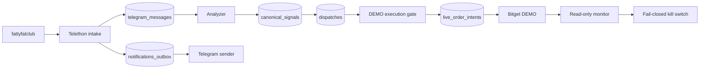

# Fatty Multi-Exchange Trader — DEMO Copy-Trade Full Report

**Evidence captured:** 2026-09-07 09:37 UTC
**Repository:** `fatty-multi-exchange-trader`
**Host/path:** `fspmi-hostinger:/home/valarion/apps/fatty-multi-exchange-trader`
**Source channel:** [`https://t.me/fattyfatclub`](https://t.me/fattyfatclub)
**Source HEAD:** `0d0ff556c5dc607b427b5376045bc7fb1c50ad8a`

Secrets, credentials, tokens, session material, and connection strings are omitted.

## Executive result

The stack is healthy and connected to the Bitget DEMO account in read-only mode. The DEMO account balance is now detected directly from the provider instead of relying on empty local snapshot tables.

```text
available       100 USDT
equity          100 USDT
margin mode     isolated
position mode   one_way_mode
positions       0
open orders     0
fills           0
provider probe  PASS
```

Provider order execution remains deliberately closed:

```text
TRADER_MODE=DEMO
BITGET_MODE=DEMO
BITGET_EXECUTION_ENABLED=0
```

No live or real-money order was created.

## Runtime inventory

| Service | State | Health |
|---|---|---|
| analyzer | running | healthy |
| dispatcher-bitget | running | healthy |
| intake | running | healthy |
| monitor-bitget | running | healthy |
| notification-sender | running | healthy |
| operator-bot | running | healthy |
| postgres | running | healthy |
| web | running | healthy |

## Source-to-dispatch flow



## Database read-back

```text
telegram_messages       6
canonical_signals        2
dispatches               4
Bitget live intents      0
pending notifications    0
active Bitget kill switch false
stale PAPER/LIVE rows    0
current DEMO heartbeats  3
```

The six persisted source records are the complete available source set. No missing messages were fabricated.

## Heartbeat/reporting topology

There are two active heartbeat producers and one delivery worker:

1. **`operator-bot`** publishes a durable heartbeat every `21600` seconds (6 hours) to `notifications_outbox`.
2. **`fatty-health-report.timer`** sends the host health report every 6 hours. It is enabled and active; next run was read back as approximately 14:33 UTC.
3. **`notification-sender`** delivers queued notifications; it is not itself a heartbeat producer.

The autonomous DEMO maintenance worker is Telegram-silent. It does not produce per-minute Telegram messages.

Historical `PAPER/LIVE` heartbeat rows were deleted after explicit operator instruction. Remaining current heartbeat rows are `DEMO/DEMO`.

## Health report correction

The old health report displayed `N/A` for the DEMO balance because it queried local `balance_snapshots`, which are empty while execution is disabled. It now runs the sanitized read-only script:

```text
scripts/bitget_demo_telemetry.py
```

The report distinguishes:

- Bitget DEMO provider read-back;
- local database snapshots;
- execution state;
- Codex quota telemetry.

`Codex Usage LIVE` means the quota response is fresh. It does not mean trading is LIVE.

The stale `Paper Ops` formatter was removed from the running `notification-sender` image and replaced with `DEMO Ops`.

## Safety controls

- Mode mismatch is rejected before Bitget execution runtime construction.
- Bitget execution defaults closed.
- Bitget monitor performs signed GET-only reconciliation and latches on unexpected provider state.
- Durable intent schema accepts runtime states `submitted` and `partially_filled` and role `EMERGENCY_CLOSE`.
- Canary symbol restriction is enforced when explicitly configured.
- Canary capacity uses an atomic PostgreSQL reservation with an advisory lock.
- Telegram source forwarding is durably deduplicated through the outbox.
- Notification claims use unique claim tokens to prevent stale lease owners from marking another worker's row sent.
- Autonomous checkpoint recovery handles missing, malformed, and non-object JSON state.

## Verification gates

```text
pytest                         288 passed
mypy src scripts               clean; 68 files
ruff check src tests scripts   clean
ruff format --check            clean
bash -n health script          clean
Bitget DEMO telemetry          PASS
Telegram health delivery      HTTP 200
```

## Git/deployment lineage

Relevant pushed commits:

- `24f1f97` — durable Bitget intent states/roles and migration v6
- `5a74698` — bounded canary reservations and migration v7
- `425a329` — durable intake and notification delivery
- `0d0ff55` — direct Bitget DEMO account telemetry and operations documentation

The working tree contains only known local untracked operational directories:

```text
.hermes/
backups/
docs/hermes-context/
```

They were not staged or modified.

## What is proven vs not proven

### Proven

- Telegram source configuration points to `@fattyfatclub`.
- Compose services are healthy.
- Authenticated Bitget DEMO account read succeeds.
- DEMO account has 100 USDT equity and correct isolated/one-way modes.
- Provider currently has zero positions, orders, and fills.
- No pending notification backlog exists.
- No active Bitget kill switch exists.
- Current heartbeat producers are six-hour cadence.
- No real-money order has been created.

### Not enabled / not claimed

- Provider mutation is not enabled.
- A copy-trade order lifecycle has not been submitted in DEMO because the execution gate is `0`.
- The source database contains six messages, not ten or an unlimited historical feed.
- Previously delivered Telegram messages cannot be deleted retroactively because their Telegram message IDs were not stored in the outbox.

## Operational commands

```bash
cd /home/valarion/apps/fatty-multi-exchange-trader

docker compose ps

docker compose --env-file .env --env-file .env.bitget-demo \
  run --rm --no-deps -e BITGET_MODE=DEMO \
  --entrypoint /app/.venv/bin/python dispatcher-bitget \
  /app/scripts/bitget_demo_telemetry.py

bash scripts/telegram_health_report.sh

systemctl --user list-timers fatty-health-report.timer --all
```

Before any future DEMO mutation, take a database backup, run the read-only probe, verify mode/account/margin/position preconditions, verify the kill switch is inactive, and define a bounded order cap and read-back evidence plan. LIVE must remain disabled for this operating track.
